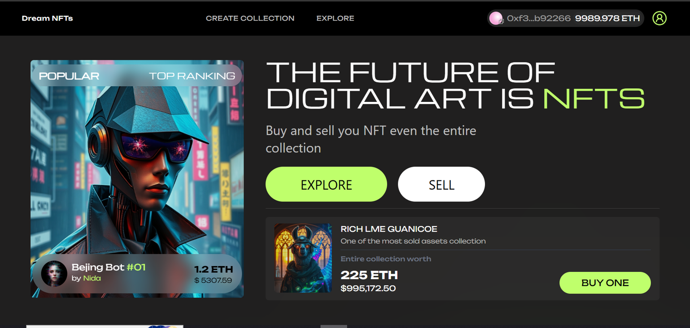

# Dream NFT Marketplace

**Description:** `Dream NFT Marketplace` is an open NFT marketplace for buyers and sellers.

**Contracts:** /frontend/contracts/src

- `NFTsMarketplaceFactory.sol`
- `NFTsCollection.sol`

---

## Working

1. **NFTsMarketplaceFactory.sol**: Allows users to create their own collection instances with their desired names and symbols. Only the collection owner can mint new NFTs, which buyers can later purchase through the `buy` function.

2. **NFTsCollection.sol**: Holds the NFTs created via the `NFTsMarketplaceFactory.sol`. Users can buy any NFT they are interested in, as long as it is available for sale and they provide the required ETH.

---

## Roles

1. **Marketplace owner:** Deploys the `NFTsMarketplaceFactory` and can withdraw the `3%` fee from each NFT purchase and collection sale.
2. **Collection owner:** Creates NFT collections, mints NFTs, and can list or delist any token from their collection. However, they cannot prevent the buying or selling of tokens once listed.
3. **User:** Buys NFTs using the `buy` function by paying the required amount of ETH.

---

## Policy

The `NFTsCollection` owner can delist any token from their collection at any time (for example, for reputation purposes). Delisted tokens will not be displayed on the client side. However, the collection owner cannot stop users from buying or selling NFTs unless they are the owner of that specific token.

---

## Revenue Model

`NFTsMarketplaceFactory` charges a `3%` fee on each NFT purchase, paid by the buyer. When a collection is sold, the same `3%` fee is charged on the `msg.value`.

---

## Audit

- **Tools:** Manual Audit & Slither

  - Reentrancy protection implemented via `ReentrancyGuard`.
  - Proper adherence to the Checks-Effects-Interactions (CEI) pattern.

---
